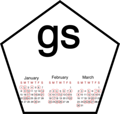

<!-- README.md is generated from README.Rmd. Please edit that file -->

```{r setup, include = FALSE}
knitr::opts_chunk$set(
  collapse = TRUE,
  comment = "#>",
  fig.path = "man/figures/README-",
  out.width = "100%"
)
```

# scheduler <a href='https://jameslairdsmith.github.io/scheduler'></a>

<!-- badges: start -->
[](https://www.tidyverse.org/lifecycle/#experimental)
<!-- badges: end -->

A schedule is a set of calendar events recurring in a pattern. `scheduler` 
is an R package for working with schedules.

Schedules can be frustrating to create, especially when the pattern of events
is irregular. `scheduler` overcomes this by providing a set of simple to 
understand functions for making schedules along with functions for combining 
them into more complex ones. 

The `scheduler` grammar is both flexible and declarative. The flexibility 
allows users to compose arbitrarily complex schedules from simple and 
intuitive buildings blocks. Because the grammar is declarative, the user 
need not concearn themselves with the details of how a particular schedule 
is created, rather they can specify the rules of a schedule and allow 
`scheduler` to implement it for them.


## Installation

The package is in the early development stage and experimental. Users are 
cautioned against relying on it for anything of importance. It can be 
downloaded from Github:

```{r, eval = FALSE}
devtools::install_github("jameslairdsmith/scheduler")
```

Feedback, bug report and suggestions are welcome and can be made in the 
[issues tab](https://github.com/jameslairdsmith/scheduler/issues) of the Github
repo.

## Getting started

If you have not used `scheduler` before, the best place to get started is the
introductory [vignette](https://jameslairdsmith.github.io/scheduler/articles/intro.html).
